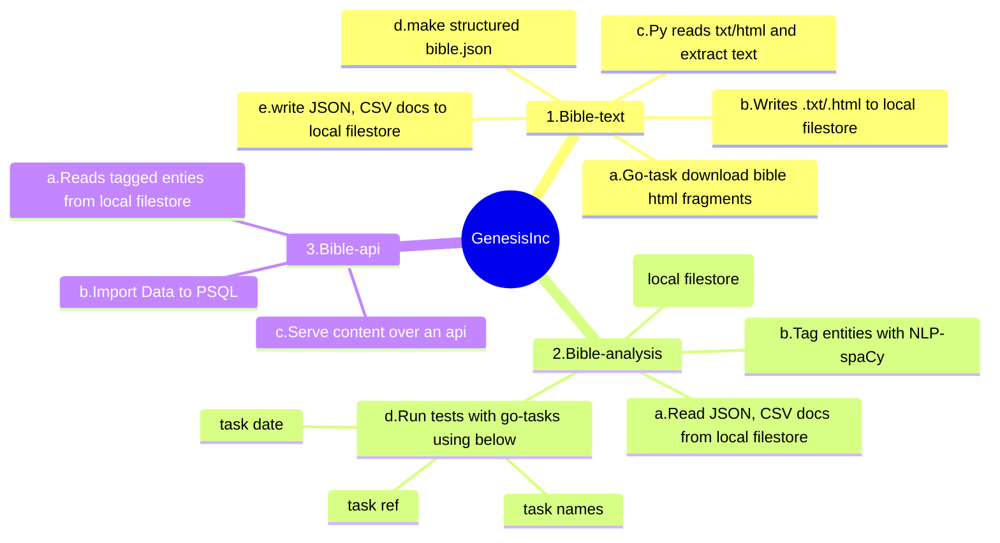

# bible text - analysis & data science

A hobby project to analyse bible-text on PERSON, Dates, ORG, NPE, Occupations, NORP etc

## Note

Analysis depends on the data generated by [bible-text][1]

Here are few things you need to remember:

- Data and reports you see here are UNVERIFIED
- Expected accuracy is about 50-60%
- Most of the reports are based on NWT 2013-English bible

## graph flow
<!-- markdownlint-disable MD001 MD046 -->

## requirements

- [go-task/task](https://github.com/go-task/task)
- [astral-sh/uv](https://github.com/astral-sh/uv)
- [miller](https://github.com/johnkerl/miller)
- [jqlang/jq](https://github.com/jqlang/jq) (optional)
- [py-nlp-spacy-uv](./README.nlp_helper.md)
- only for developers - [developer setup](./docs/README.nlp_helper.md)

## initial setup

    git clone https://github.com/GenesisInc/bible-text.git

Update taskfile.yaml with the cloned path of bible-text

Navigate to bible-analysis and run below command to link the data:

    task link-data

--OR--
Manually create those 2 links mentioned in the taslfile.yaml->link-data

[bible-data][1] repo --provides file --> |nwt_bible.json|  

    - nwt_bible.json file used by this project to do below
        extract PERSON, ORG and etc and write to
        data/tmp/bible_entities.csv

then, you may run below commands to see the data.

## usage - interact directly with python scripts

- get help

        ❯ uv run main.py --help
        usage: main.py [-h] {tag-entities,search,reference,extract,trips,science} ...

        CLI to process Bible text, extract entities, and perform searches.

        options:
        -h, --help            show this help message and exit

        Commands:
        {tag-entities,search,reference,extract,trips,science}
            tag-entities        Extract entities, occupations, lifespans and etc.
            search              Search for a phrase in the Bible text and display matches.
            reference           Extract text for a specific Bible reference.
            extract             Extract a specific translation from the multi-translation JSON.
            trips               view travels
            science             Generate timeline charts for scientific and biblical events.

- tag-entities

        uv run main.py \
            tag-entities \
            --input-file "data/nwt_bible.json" \
            --output-json "data/nwt_entities.json" \
            --output-csv "data/nwt_entities.csv" \
            --translation "nwt"

- extract translations

        # extract asv
        uv run python3 main.py extract --translation "asv" \
            --input-file data/multi_translation.json \
            --output-file data/asv_bible.json

- get reference

        uv run python3 main.py reference \
            --input-file data/nwt_bible.json \
            --translation nwt \
            --reference "revelation 1:1-4"

- search text

        uv run python3 main.py search --phrase 'word of god' \
            --input-file "data/nwt_bible.json" \
            --top-n 5 --csv \
            --translation nwt

- chart trips

        uv run main.py trips

- science facts

        uv run main.py science

## usage - sample reports with tasks

- legends

        ❯ task legends
            +--------------+-------+----------------------------------------------+
            | Type         | count | Explanation                                  |
            +--------------+-------+----------------------------------------------+
            | DATE         | 2781  | Explicit or implicit date expressions        |
            | EVENT        | 1011  | Other                                        |
            | GPE          | 6665  | Geopolitical entities (places)               |
            | LIFESPAN     | 174   | Lifespan of persons                          |
            | NORP         | 1249  | Nationalities, religious or political groups |
            | OCCUPATION   | 4734  | Roles or professions                         |
            | ORG          | 3377  | Organizations or groups                      |
            | PERSON       | 11712 | Names of individuals                         |
            | RELATIONSHIP | 1011  | Other                                        |
            +--------------+-------+----------------------------------------------+

This needs .env to read the values for below variables to connect to Psql db.

- summary

        ❯ task summary
            +---------------+-------+------+---------------------------------------------+
            | item          | total | uniq | exp                                         |
            +---------------+-------+------+---------------------------------------------+
            | DATE          | 3356  | 707  | Explicit or implicit date expressions       |
            | GPE           | 8946  | 1058 | Geopolitical entities (places)              |
            | NORP          | 1325  | 241  | Nationalities religious or political groups |
            | OCCUPATION    | 4734  | 1    | Roles or professions                        |
            | ORG           | 4136  | 1204 | Organizations or groups                     |
            | PERSON        | 16326 | 1656 | Names of individuals                        |
            | RELATIONSHIP  | 1983  | 552  | Other                                       |
            | occupations   | 4734  | 1    | Other                                       |
            | relationships | 1983  | 552  | Other                                       |
            +---------------+-------+------+---------------------------------------------+

        ❯ cat .env
        # DB secrets
        DB_NAME=example_db_name
        DB_USER=example_db_user

- names recorded in the bible

        ❯ task names
            Summary:
            Total: 11712 records
            Showing 16 of 11712 records
            Translation: nwt
            +----+------------+---------+-------+--------+---------+--------------------------------------+
            | n  | Book       | Chapter | Verse | Type   | Trigger | Context                              |
            +----+------------+---------+-------+--------+---------+--------------------------------------+
            | 1  | genesis    | 1       | 3     | PERSON | God     | And God said : Let                   |
            | 2  | genesis    | 2       | 4     | PERSON | Jehovah | the day that Jehovah God made earth  |
            | 3  | genesis    | 2       | 5     | PERSON | bush    | No bush of the field                 |
            | 4  | genesis    | 2       | 7     | PERSON | Jehovah | And Jehovah God went on              |
            | 5  | genesis    | 2       | 8     | PERSON | Jehovah | Further , Jehovah God planted a      |
            | 6  | genesis    | 2       | 11    | PERSON | Havilah | entire land of Havilah , where there |
            | 7  | genesis    | 2       | 13    | PERSON | Gihon   | second river is Gihon ; it is        |
            | 8  | genesis    | 2       | 19    | PERSON | Jehovah | Now Jehovah God had been             |
            | 9  | revelation | 21      | 22    | PERSON | Jehovah | it , for Jehovah God the Almighty    |
            | 10 | revelation | 22      | 5     | PERSON | Jehovah | sunlight , for Jehovah God will shed |
            | 11 | revelation | 22      | 6     | PERSON | Jehovah | ; yes , Jehovah , the God            |
            | 12 | revelation | 22      | 8     | PERSON | John    | Well I , John , was the              |
            | 13 | revelation | 22      | 13    | PERSON | Alpha   | I am the Alpha and the Omega         |
            | 14 | revelation | 22      | 16    | PERSON | Jesus   | I , Jesus , sent my                  |
            | 15 | revelation | 22      | 20    | PERSON | Jesus   | Come , Lord Jesus .                  |
            | 16 | revelation | 22      | 21    | PERSON | Jesus   | of the Lord Jesus be with the        |
            +----+------------+---------+-------+--------+---------+--------------------------------------+

- distinct names

        ❯ task unique-names
            Summary:
            Total: 1234 records
            Showing 16 of 1234 records
            Translation: nwt
            +----+-----------------------+-------+
            | n  | Trigger               | count |
            +----+-----------------------+-------+
            | 1  | Aaron                 | 224   |
            | 2  | Abarim                | 2     |
            | 3  | Abdiel                | 1     |
            | 4  | Abdon                 | 4     |
            | 5  | Abdon the son         | 1     |
            | 6  | Abednego              | 9     |
            | 7  | Abel                  | 8     |
            | 8  | Abi                   | 6     |
            | 9  | jarkon                | 1     |
            | 10 | leafy trees           | 1     |
            | 11 | meaningless comfort   | 1     |
            | 12 | mosaic pebbles        | 1     |
            | 13 | myrrh                 | 6     |
            | 14 | myrrh Spending        | 1     |
            | 15 | pervert righteousness | 1     |
            | 16 | the King of Israel    | 1     |
            +----+-----------------------+-------+

- most frequent names

        ❯ task top-names
            Summary:
            Total: 10 records
            Showing all 10 records
            Translation: nwt
            +----+---------+-------+
            | n  | Trigger | count |
            +----+---------+-------+
            | 1  | Joshua  | 152   |
            | 2  | Joseph  | 154   |
            | 3  | Abraham | 158   |
            | 4  | Solomon | 170   |
            | 5  | Saul    | 174   |
            | 6  | Jacob   | 179   |
            | 7  | Aaron   | 224   |
            | 8  | David   | 552   |
            | 9  | Jesus   | 664   |
            | 10 | Jehovah | 3846  |
            +----+---------+-------+

- Organizations mentioned

        ❯ task org
            Summary:
            Total: 3377 records
            Showing 16 of 3377 records
            Translation: nwt
            +----+------------+---------+-------+------+---------+---------------------------------------------+
            | n  | Book       | Chapter | Verse | Type | Trigger | Context                                     |
            +----+------------+---------+-------+------+---------+---------------------------------------------+
            | 1  | genesis    | 2       | 11    | ORG  | Pishon  | the first is Pishon ; it is                 |
            | 2  | genesis    | 4       | 1     | ORG  | Cain    | gave birth to Cain , she said               |
            | 3  | genesis    | 4       | 2     | ORG  | Cain    | flock , but Cain became a cultivator        |
            | 4  | genesis    | 4       | 3     | ORG  | Cain    | some time , Cain brought some fruits        |
            | 5  | genesis    | 4       | 5     | ORG  | Cain    | any favor on Cain and on his                |
            | 6  | genesis    | 4       | 8     | ORG  | Cain    | After that Cain said to his                 |
            | 7  | genesis    | 4       | 13    | ORG  | Cain    | At this Cain said to Jehovah                |
            | 8  | genesis    | 4       | 15    | ORG  | Cain    | anyone who kills Cain will suffer vengeance |
            | 9  | revelation | 9       | 11    | ORG  | Abaddon | his name is Abaddon , but in                |
            | 10 | revelation | 11      | 8     | ORG  | Sodom   | spiritual sense called Sodom and Egypt ,    |
            | 11 | revelation | 12      | 9     | ORG  | Devil   | the one called Devil and Satan ,            |
            | 12 | revelation | 12      | 12    | ORG  | Devil   | , because the Devil has come down           |
            | 13 | revelation | 19      | 7     | ORG  | Lamb    | marriage of the Lamb has arrived and        |
            | 14 | revelation | 20      | 2     | ORG  | Devil   | who is the Devil and Satan ,                |
            | 15 | revelation | 21      | 6     | ORG  | Omega   | Alpha and the Omega , the beginning         |
            | 16 | revelation | 22      | 13    | ORG  | Omega   | Alpha and the Omega , the first             |
            +----+------------+---------+-------+------+---------+---------------------------------------------+
            Legend.ORG - Organization or groups

- Occupations

        ❯ task occupation
            Summary:
            Total: 4734 records
            Showing 16 of 4734 records
            Translation: nwt
            +----+------------+---------+-------+------------+----------+------------------------------------------------+
            | n  | Book       | Chapter | Verse | Type       | Trigger  | Context                                        |
            +----+------------+---------+-------+------------+----------+------------------------------------------------+
            | 1  | genesis    | 4       | 2     | OCCUPATION | shepherd | Abel became a shepherd of the flock            |
            | 2  | genesis    | 9       | 20    | OCCUPATION | farmer   | off as a farmer , and he                       |
            | 3  | genesis    | 9       | 25    | OCCUPATION | slave    | become the lowest slave to his brothers        |
            | 4  | genesis    | 9       | 26    | OCCUPATION | slave    | Canaan become a slave to him .                 |
            | 5  | genesis    | 9       | 27    | OCCUPATION | slave    | Canaan become a slave to him also              |
            | 6  | genesis    | 10      | 9     | OCCUPATION | hunter   | became a mighty hunter in opposition to        |
            | 7  | genesis    | 12      | 16    | OCCUPATION | servant  | male and female servants , and camels          |
            | 8  | genesis    | 13      | 7     | OCCUPATION | herder   | arose between the herders of Abrams livestock  |
            | 9  | revelation | 20      | 10    | OCCUPATION | prophet  | and the false prophet already were ;           |
            | 10 | revelation | 20      | 12    | OCCUPATION | judge    | The dead were judged out of those              |
            | 11 | revelation | 20      | 13    | OCCUPATION | judge    | and they were judged individually according to |
            | 12 | revelation | 21      | 24    | OCCUPATION | king     | , and the kings of the earth                   |
            | 13 | revelation | 22      | 3     | OCCUPATION | slave    | , and his slaves will offer him                |
            | 14 | revelation | 22      | 5     | OCCUPATION | king     | will rule as kings forever and ever            |
            | 15 | revelation | 22      | 6     | OCCUPATION | prophet  | who inspired the prophets , has sent           |
            | 16 | revelation | 22      | 9     | OCCUPATION | slave    | only a fellow slave of you and                 |
            +----+------------+---------+-------+------------+----------+------------------------------------------------+

- occupation-summary

        ❯ task occupation-summary
            top and bottom 8 of sorted by occupation
                Summary:
                Total: 44 records
                Showing 16 of 44 records
                Translation: nwt
                +----+-------------+-------+
                | n  | occupation  | count |
                +----+-------------+-------+
                | 1  | astrologer  | 2     |
                | 2  | baker       | 5     |
                | 3  | beggar      | 5     |
                | 4  | carpenter   | 2     |
                | 5  | charioteer  | 4     |
                | 6  | cook        | 11    |
                | 7  | cupbearer   | 8     |
                | 8  | elder       | 146   |
                | 9  | slave       | 241   |
                | 10 | soldier     | 61    |
                | 11 | spy         | 36    |
                | 12 | stonecutter | 6     |
                | 13 | teacher     | 54    |
                | 14 | tentmaker   | 1     |
                | 15 | trader      | 4     |
                | 16 | weaver      | 4     |
                +----+-------------+-------+

            top and bottom 8 of sorted by count
                Summary:
                Total: 44 records
                Showing 16 of 44 records
                Translation: nwt
                +----+-------------+-------+
                | n  | occupation  | count |
                +----+-------------+-------+
                | 1  | musician    | 1     |
                | 2  | perfumer    | 1     |
                | 3  | executioner | 1     |
                | 4  | tentmaker   | 1     |
                | 5  | mason       | 2     |
                | 6  | astrologer  | 2     |
                | 7  | fisher      | 2     |
                | 8  | carpenter   | 2     |
                | 9  | shepherd    | 105   |
                | 10 | elder       | 146   |
                | 11 | judge       | 225   |
                | 12 | slave       | 241   |
                | 13 | prophet     | 346   |
                | 14 | servant     | 631   |
                | 15 | priest      | 758   |
                | 16 | king        | 1797  |
                +----+-------------+-------+

- most frequently mentioned occupations

        ❯ task top-occupations
            ❯ task top-occupations
            Summary:
            Total: 10 records
            Showing all 10 records
            Translation: nwt
            +----+----------+-------+
            | n  | Trigger  | count |
            +----+----------+-------+
            | 1  | teacher  | 54    |
            | 2  | soldier  | 61    |
            | 3  | shepherd | 105   |
            | 4  | elder    | 146   |
            | 5  | judge    | 225   |
            | 6  | slave    | 241   |
            | 7  | prophet  | 346   |
            | 8  | servant  | 631   |
            | 9  | priest   | 758   |
            | 10 | king     | 1797  |
            +----+----------+-------+

- distinct occupations

        ❯ task unique-occupation
            mlr --csv --from data/nwt_entities.csv \
                filter '$Type == "OCCUPATION"' \
                then cut -f Trigger \
                then count-distinct -f Trigger \
                then sort -nf count

- Geo Political Entities(gpe)

        ❯ task gpe
            Summary:
            Total: 6665 records
            Showing 16 of 6665 records
            Translation: nwt
            +----+------------+---------+-------+------+----------------+----------------------------------------------+
            | n  | Book       | Chapter | Verse | Type | Trigger        | Context                                      |
            +----+------------+---------+-------+------+----------------+----------------------------------------------+
            | 1  | genesis    | 2       | 8     | GPE  | Eden           | a garden in Eden , toward the                |
            | 2  | genesis    | 2       | 10    | GPE  | Eden           | flowing out of Eden to water the             |
            | 3  | genesis    | 2       | 14    | GPE  | Assyria        | the east of Assyria . And the                |
            | 4  | genesis    | 2       | 15    | GPE  | Eden           | the garden of Eden to cultivate it           |
            | 5  | genesis    | 3       | 23    | GPE  | Eden           | the garden of Eden to cultivate the          |
            | 6  | genesis    | 3       | 24    | GPE  | Eden           | the garden of Eden the cherubs and           |
            | 7  | genesis    | 4       | 1     | GPE  | Jehovah        | the help of Jehovah .                        |
            | 8  | genesis    | 4       | 16    | GPE  | Eden           | the east of Eden .                           |
            | 9  | revelation | 7       | 4     | GPE  | Israel         | the sons of Israel :                         |
            | 10 | revelation | 7       | 6     | GPE  | Naphtali       | the tribe of Naphtali 12,000;out of the      |
            | 11 | revelation | 11      | 8     | GPE  | Egypt          | called Sodom and Egypt , where their         |
            | 12 | revelation | 11      | 15    | GPE  | the Kingdom of | world has become the Kingdom of our Lord and |
            | 13 | revelation | 12      | 10    | GPE  | the Kingdom of | the power and the Kingdom of our God and     |
            | 14 | revelation | 21      | 2     | GPE  | New Jerusalem  | holy city , New Jerusalem , coming down      |
            | 15 | revelation | 21      | 10    | GPE  | Jerusalem      | the holy city Jerusalem coming down out      |
            | 16 | revelation | 21      | 12    | GPE  | Israel         | the sons of Israel .                         |
            +----+------------+---------+-------+------+----------------+----------------------------------------------+
            Legend.GPE - GeoPoliticalEntity

- dates mentioned

        ❯ task date
            Summary:
            Total: 2781 records
            Showing 16 of 2781 records
            Translation: nwt
            +----+------------+---------+-------+------+-----------------------+---------------------------------------------------------+
            | n  | Book       | Chapter | Verse | Type | Trigger               | Context                                                 |
            +----+------------+---------+-------+------+-----------------------+---------------------------------------------------------+
            | 1  | genesis    | 1       | 5     | DATE | the light Day         | God called the light Day , but the                      |
            | 2  | genesis    | 1       | 13    | DATE | a third day           | was morning , a third day .                             |
            | 3  | genesis    | 1       | 14    | DATE | between the day       | make a division between the day and the night           |
            | 4  | genesis    | 1       | 16    | DATE | the day               | luminary for dominating the day and the lesser          |
            | 5  | genesis    | 1       | 18    | DATE | day                   | to dominate by day and by night                         |
            | 6  | genesis    | 1       | 19    | DATE | a fourth day          | was morning , a fourth day .                            |
            | 7  | genesis    | 1       | 23    | DATE | a fifth day           | was morning , a fifth day .                             |
            | 8  | genesis    | 1       | 31    | DATE | a sixth day           | was morning , a sixth day .                             |
            | 9  | revelation | 20      | 3     | DATE | the 1,000 years       | nations anymore until the 1,000 years were ended .      |
            | 10 | revelation | 20      | 4     | DATE | 1,000 years           | the Christ for 1,000 years .                            |
            | 11 | revelation | 20      | 5     | DATE | the 1,000 years       | to life until the 1,000 years were ended .              |
            | 12 | revelation | 20      | 6     | DATE | the 1,000 years       | with him for the 1,000 years .                          |
            | 13 | revelation | 20      | 7     | DATE | the 1,000 years       | as soon as the 1,000 years have ended ,                 |
            | 14 | revelation | 21      | 6     | DATE | the spring            | will give from the spring of the water                  |
            | 15 | revelation | 21      | 20    | DATE | the eleventh hyacinth | tenth chrysoprase , the eleventh hyacinth , the twelfth |
            | 16 | revelation | 22      | 2     | DATE | each month            | yielding their fruit each month . And the               |
            +----+------------+---------+-------+------+-----------------------+---------------------------------------------------------+

- Nationalities Religions or Political Groups (norp)

        ❯ task norp
            Summary:
            Total: 1249 records
            Showing 16 of 1249 records
            Translation: nwt
            +----+------------+---------+-------+------+-----------+--------------------------------------------+
            | n  | Book       | Chapter | Verse | Type | Trigger   | Context                                    |
            +----+------------+---------+-------+------+-----------+--------------------------------------------+
            | 1  | genesis    | 6       | 5     | NORP | mans      | Jehovah saw that mans wickedness was great |
            | 2  | genesis    | 8       | 21    | NORP | mans      | the ground on mans account , for           |
            | 3  | genesis    | 10      | 4     | NORP | Tarshish  | were Elishah , Tarshish , Kittim ,         |
            | 4  | genesis    | 10      | 18    | NORP | Zemarite  | Arvadite , the Zemarite , and the          |
            | 5  | genesis    | 11      | 18    | NORP | Reu       | became father to Reu .                     |
            | 6  | genesis    | 11      | 28    | NORP | Chaldeans | Ur of the Chaldeans .                      |
            | 7  | genesis    | 11      | 31    | NORP | Chaldeans | Ur of the Chaldeans to go to               |
            | 8  | genesis    | 12      | 12    | NORP | Egyptians | So when the Egyptians see you ,            |
            | 9  | revelation | 17      | 14    | NORP | Lamb      | battle with the Lamb , but because         |
            | 10 | revelation | 18      | 13    | NORP | Indian    | also cinnamon , Indian spice , incense     |
            | 11 | revelation | 21      | 14    | NORP | Lamb      | apostles of the Lamb .                     |
            | 12 | revelation | 21      | 17    | NORP | mans      | according to a mans measure , at           |
            | 13 | revelation | 21      | 22    | NORP | Lamb      | , also the Lamb is .                       |
            | 14 | revelation | 21      | 23    | NORP | Lamb      | lamp was the Lamb .                        |
            | 15 | revelation | 22      | 1     | NORP | Lamb      | and of the Lamb                            |
            | 16 | revelation | 22      | 3     | NORP | Lamb      | and of the Lamb will be in                 |
            +----+------------+---------+-------+------+-----------+--------------------------------------------+
            Legend.NORP - Nationalities Religions or Political Groups

- search for words, numbers or phrases

        1❯ task search -- jonathan
            Showing top 5 of 105 matches from 'nwt' translation
            +--------------+---------+-------+----------------------------------------------------------------------+
            | book         | chapter | verse | text                                                                 |
            +--------------+---------+-------+----------------------------------------------------------------------+
            | nehemiah     | 12      | 14    | for Malluchi, Jonathan; for Shebaniah, Joseph;                       |
            | 2 samuel     | 23      | 32    | Eliahba the Shaalbonite, the sons of Jashen, Jonathan,               |
            | 2 samuel     | 1       | 17    | Then David chanted this dirge over Saul and his son Jonathan         |
            | 1 samuel     | 20      | 4     | Then Jonathan said to David: Whatever you say, I will do for you.    |
            | 1 chronicles | 8       | 34    | And Jonathans son was Merib baal. Merib baal became father to Micah. |
            +--------------+---------+-------+----------------------------------------------------------------------+

        2❯ task search -- "declares the Sovereign Lord Jehovah"
            Showing top 5 of 87 matches from 'nwt' translation
            +---------+---------+-------+---------------------------------------------------------------------------------------------------------+
            | book    | chapter | verse | text                                                                                                    |
            +---------+---------+-------+---------------------------------------------------------------------------------------------------------+
            | ezekiel | 16      | 23    | After all your evil, woe, woe to you, declares the Sovereign Lord Jehovah.                              |
            | amos    | 3       | 13    | Hear and warn the house of Jacob, declares the Sovereign Lord Jehovah, the God of armies.               |
            | ezekiel | 39      | 5     | You will fall on the open field, for I myself have spoken, declares the Sovereign Lord Jehovah.         |
            | ezekiel | 11      | 8     | A sword you have feared, and a sword I will bring against you, declares the Sovereign Lord Jehovah.     |
            | ezekiel | 34      | 15    | I myself will feed my sheep, and I myself will make them lie down, declares the Sovereign Lord Jehovah. |
            +---------+---------+-------+---------------------------------------------------------------------------------------------------------+

        3❯ task search -- 666
            Showing top 4 of 4 matches from 'nwt' translation
            +--------------+---------+-------+--------------------------------------------------------------------------------------------------------------------------------------------------------+
            | book         | chapter | verse | text                                                                                                                                                   |
            +--------------+---------+-------+--------------------------------------------------------------------------------------------------------------------------------------------------------+
            | ezra         | 2       | 13    | the sons of Adonikam, 666;                                                                                                                             |
            | 1 kings      | 10      | 14    | And the weight of the gold that came to Solomon in one year amounted to 666 talents of gold,                                                           |
            | 2 chronicles | 9       | 13    | And the weight of the gold that came to Solomon in one year amounted to 666 talents of gold,                                                           |
            | revelation   | 13      | 18    | This is where it calls for wisdom: Let the one who has insight calculate the number of the wild beast, for it is a mans number, and its number is 666. |
            +--------------+---------+-------+--------------------------------------------------------------------------------------------------------------------------------------------------------+

        4❯ task search -- "Jehovah of armies"
            Showing top 5 of 249 matches from 'nwt' translation
            +-----------+---------+-------+------------------------------------------------------------------+
            | book      | chapter | verse | text                                                             |
            +-----------+---------+-------+------------------------------------------------------------------+
            | zechariah | 8       | 1     | The word of Jehovah of armies again came, saying:                |
            | zechariah | 7       | 4     | The word of Jehovah of armies again came to me, saying:          |
            | zechariah | 8       | 18    | The word of Jehovah of armies again came to me, saying:          |
            | psalms    | 84      | 12    | O Jehovah of armies, Happy is the man who trusts in you.         |
            | isaiah    | 39      | 5     | Isaiah now said to Hezekiah: Hear the word of Jehovah of armies, |
            +-----------+---------+-------+------------------------------------------------------------------+

- get bible text using references

        ❯ task ref -- genesis 1:1
            nwt  : In the beginning God created the heavens and the earth.

        ❯ task ref -- genesis 1:1-1:6
            nwt  : In the beginning God ... and the waters.

        ❯ task ref -- genesis 1:25-2:2
            nwt  : And God went on to make the ... that he had been doing.

        ❯ task ref -- song of solomon 1:3
            nwt  : The fragrance of your oils is pleasant. ... why the young women love you.

        ❯ task ref -- 2 john 2
            nwt  : because of the truth that remains in us and will be with us forever.

        ❯ task ref -- 2 john 1:2
            nwt  : because of the truth that remains in us and will be with us forever.

## tag entities

- tag entities

        ❯ task tag-entities
            uv run main.py \
            tag-entities \
            --input-file "${bible_file}" \
            --output-json "${out_json}" \
            --output-csv "${out_csv}" \
            --translation "{{.CLI_ARGS| default .translation}}"

        data successfully written to data/nwt_entities.json
        CSV results saved to bible_entities.csv

Now, you have bible_entities.json & bible_entities.csv.

You may try to query occupations, persons, orgs etc

NOTE: Please remember these data is generated programmatically and UNVERIFIED.

[1]: https://github.com/GenesisInc/bible-text
