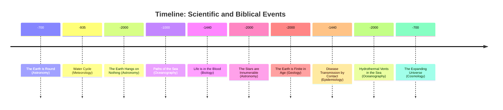
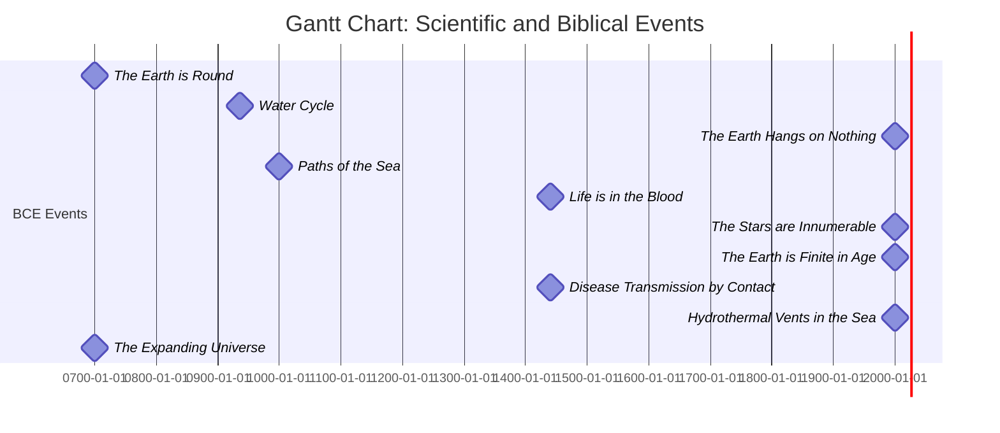

# Timeline and Gantt Charts

## Timeline: Scientific and Biblical Events

```mermaid
timeline
    title Timeline: Scientific and Biblical Events
    -700: The Earth is Round (Astronomy)
    -935: Water Cycle (Meteorology)
    -2000: The Earth Hangs on Nothing (Astronomy)
    -1000: Paths of the Sea (Oceanography)
    -1440: Life is in the Blood (Biology)
    -2000: The Stars are Innumerable (Astronomy)
    -2000: The Earth is Finite in Age (Geology)
    -1440: Disease Transmission by Contact (Epidemiology)
    -2000: Hydrothermal Vents in the Sea (Oceanography)
    -700: The Expanding Universe (Cosmology)
```

## Gantt Chart: Scientific and Biblical Events

```mermaid
gantt
    title Gantt Chart: Scientific and Biblical Events
    dateFormat  YYYY
    section BCE Events
    The Earth is Round: milestone, -700, 1d
    Water Cycle: milestone, -935, 1d
    The Earth Hangs on Nothing: milestone, -2000, 1d
    Paths of the Sea: milestone, -1000, 1d
    Life is in the Blood: milestone, -1440, 1d
    The Stars are Innumerable: milestone, -2000, 1d
    The Earth is Finite in Age: milestone, -2000, 1d
    Disease Transmission by Contact: milestone, -1440, 1d
    Hydrothermal Vents in the Sea: milestone, -2000, 1d
    The Expanding Universe: milestone, -700, 1d
    section CE Events
```
